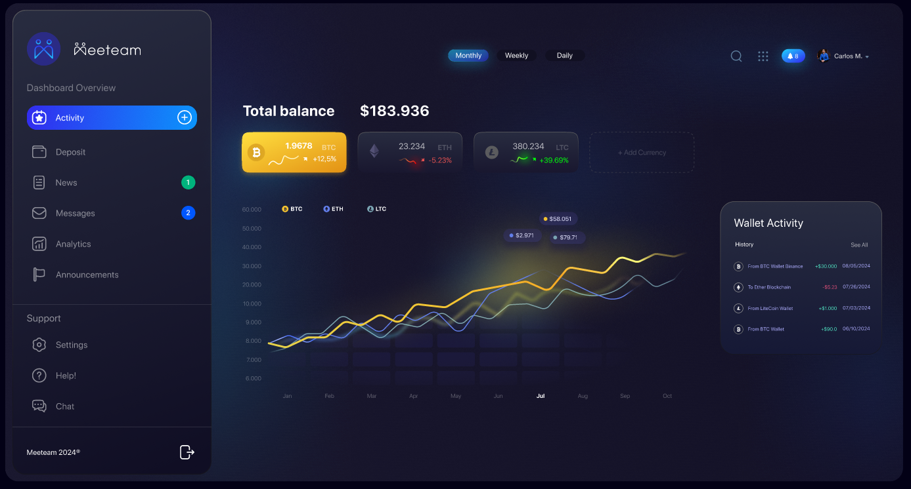

# Test for Meeteam.

This is a project created for **Meeteam's technical test** for the position of **Front end developer React.js**.
The test is to replicate as best as possible the design of the following dashboard.



## **Results demonstration 🧰**


### Key points achieved.

- ✅ Create dashboard design.
- ✅ Add responsive design for the activity page.
- ✅ Add responsive design for the left side menu.
- ✅ Implement chart, using Chart.js.
- ✅ Navigation between pages.

## **Installation 🧰**

1. Clone the repository (you need to have [Git](https://git-scm.com) installed).

```shell
    git clone https://github.com/Franklin361/test-dashboard.git
```

2.  Install dependencies of the project.

```shell
    pnpm install
```

3. Run the project.
```shell
    pnpm dev
```

4. Go to **http://localhost:5173/** to see the app


&nbsp;

## **📢 Demo link**

[test-dashboard-meeteam.netlify.app/](test-dashboard-meeteam.netlify.app/)
